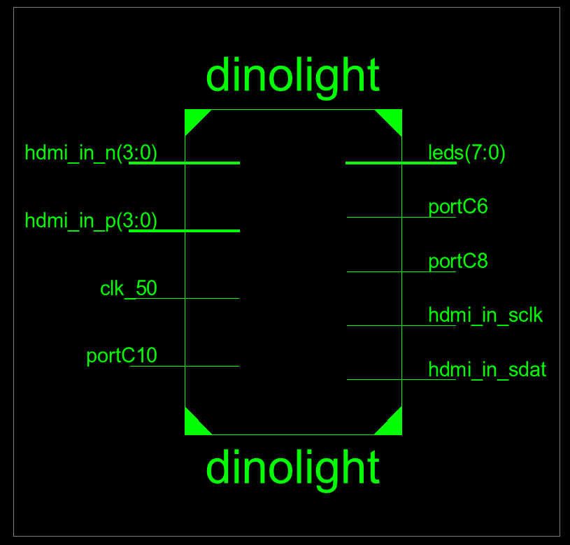
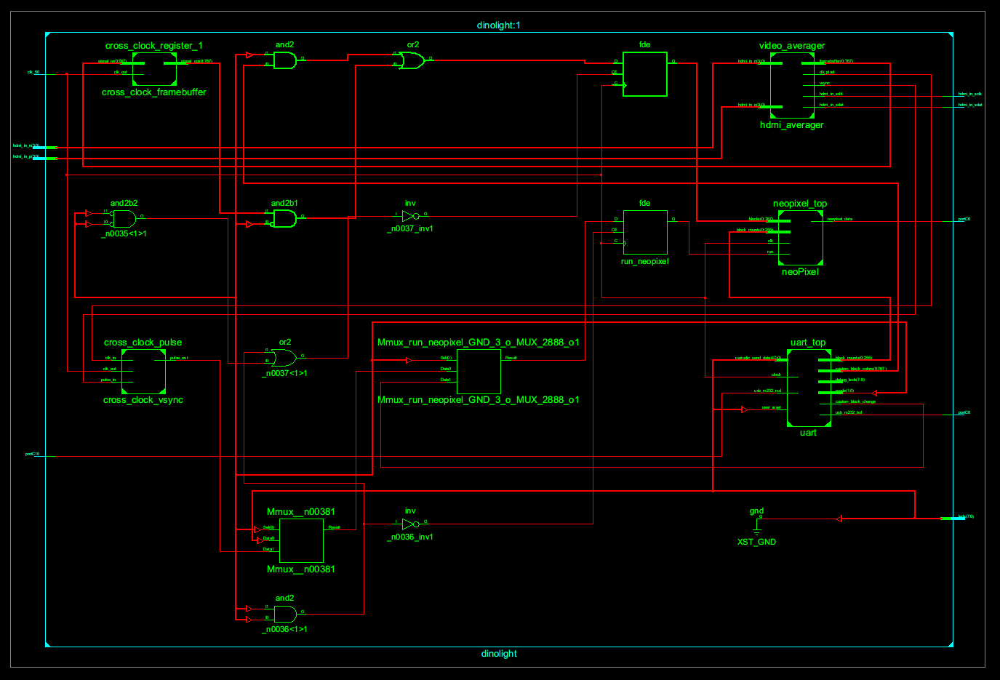
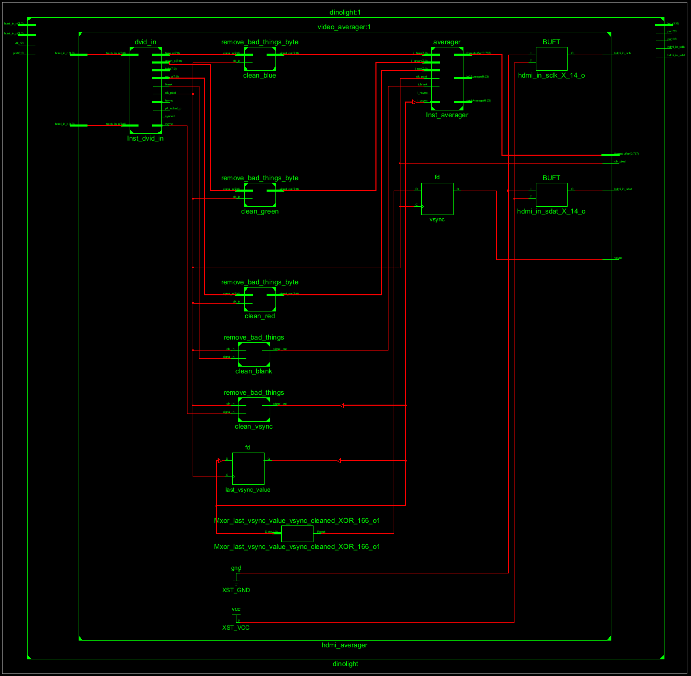
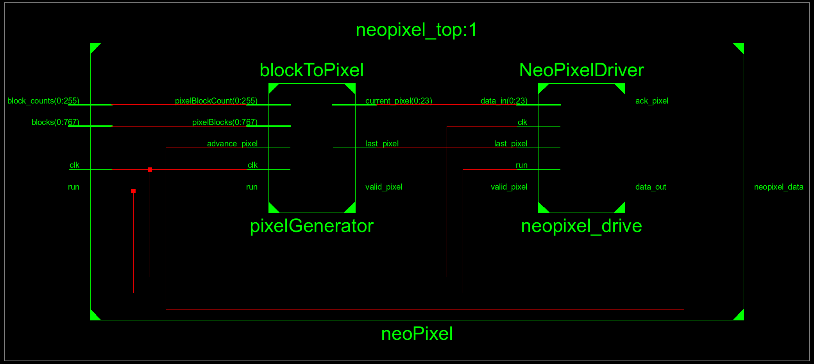
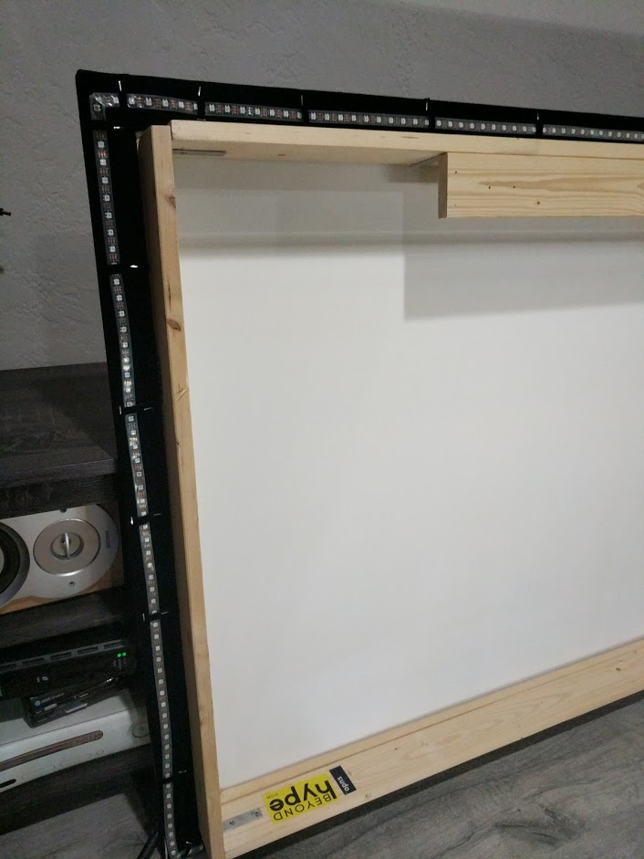

# Description

This project will use a Raspberry Pi and an FPGA to achieve the dynamic back lighting for a TV. The
Raspberry Pi will be running a static web app and a web server. The app will talk to the
web server using HTTP requests to configure the system. The web server will be talking to the
FPGA over the Pi’s UART connection. The web server will also be able to generate patterns to
be displayed on the LEDs. The FPGA will be doing the image processing for the system,
calculating each of the individual backlight colors, and communicating with the LEDs on the
back of the screen. In front of the FPGA a HDMI duplicator and downscaler will allow the
source image to continue to the screen and be handled by the FPGA.
This project was inspired by a blogpost on [zero characters left](http://zerocharactersleft.blogspot.com/2015/04/diy-fpga-based-hdmi-ambient-lighting.html).

# Senior Design Mission Statement

Since this project was used as my Computer Engineer Senior Design project,
I had to come up with a project mission statement:

```text
The objective of this project is to design and prototype a device that will improve the
immersion of videos by adding dynamic back lighting to a monitor. The device will contain a
micro controller and FPGA to control and configure the system. The user will communicate with
and configure the system through an application. After configuration, the system will function
autonomously and will not need input from the user.
```

# Basic Background Information

To start I want to go over some basic background information on technology in the
project that most people might not be familiar with: FPGAs and how Video Signals work

### FPGAs

FPGAs are one of the coolest piece of technology (conceptually at least)
I have ever worked with. The base idea is you can build programmable
hardware that is really good at one task. They lie somewhere in the middle
of a GPP (general purpose process such as the CPU in a computer) and a
ASIC (Application specific integrated circuit). They work by building
hardware logic gates using Look up tables (LUT). For example a two input AND gate
can be designed using a LUT like:

```text
          ____
L|0| ->  | M  | 
U|0| ->  | U  |-> A&B
T|0| ->  | X  |
 |1| ->  |____|
          |  |
          A  B
```

Or the LUT can be a programed differently so a OR gate can be represented.

```text
          ____
L|0| ->  | M  | 
U|1| ->  | U  |-> A|B
T|1| ->  | X  |
 |1| ->  |____|
          |  |
          A  B
```

FPGAs are "programmed" using HDL, Verilog or VHDL, that describes how
the logic acts.
The compiler then takes the HDL and converts it to a bit file that is used
to configure the hardware present on the FPGA. This involves programming all the luts on the board. HDL is similar to HTML in that it is descriptive, it describes by how the FPGA should act.
None of the HDL that is written is executed during the FPGA run time, mostly because
since there simply is no runtime.

FPGAs are more expensive, "slower" (I physically could not have the fpga work at a speed required for 4k),  have a much larger physical footprint, and limited general compute power than their
ASIC counterpart. However their ability to be re-programmed, low entry cost, and
ease of change make FPGAs viable solutions for a wide range of applications.
One area they work well is when dealing with any sort of real time signal
processing. If you wanted to read a high bandwidth signal
off a wire, a general purpose processor, or GPP, (Arduino, ARM) would need to fire an interrupt, read
the signal, add that signal to a buffer, then find time between interrupts
to process the signal. The higher bandwidth the signal is, the faster the
processor needs to be. However, assuming the signal is within the required frequency, a FPGA can work on all those steps in parallel.
One set of LUTS can be focused on reading the signals, one set can be
reading/writing to shared memory, while another is doing any sort of processing.
A GPP could then read the processed memory for basically free.

As someone who as taught FGPA design, the hardest conceptual leap is the
to understand is the parallel nature of what you are building.
When looking at traditional code, each instruction is sequential since a
processor can only do one instruction at a time.
So if you then carry that mindset over to FPGAs, you're going to have a
bad time; sine on a FPGA,  multiple things can happen at once.

For Example the flowing vhdl code with signals A, B, C:
```vhdl
if rising_edge(clk) then
  A <= B;
  C <= A;
end if;
```

Most people would assume that on each clock cycle, first A get set to B,
then C get set to A, thus C = B.
However this is incorrect since both A and C get updated at the same time,
thus after each clock cycle  A = B and C = A' (whatever A was BEFORE the clock ).

Here is a good post I found to give some more background on a FPGA
http://www.righto.com/2018/03/implementing-fizzbuzz-on-fpga.html

### Video Signals

Almost all video signals operate the same way. While the way they are
transported differs widely depending on the medium
(HDMI, DVI, Display Port, compressed/uncompressed) they all end up
becoming the same right before they get displayed on the screen, usually seen in
a 40-pin ribbon cable.

- Pixel Clock: High* when there is valid information on the other signals
- Pixel value (24 bit): the three byte pixel value in RGB form
- H-sync: High* when the current pixel is the last pixel on the row
- V-Sync: High* when the current pixel is the last pixel on the screen

To tie these signals to some common TV terms:
A screen with a 60 Hz Refresh rate will have V-sync high* 60 times a second
A screen with resolution of 1920x1080 will have a h-sync high* every
1920 pixels, and there will be 1080 of them for each V-Sync

*Assume Active High Signals

# Project

## Design

The system will be split into two main parts, a web server running on a Raspberry Pi and an
FPGA doing video-image processing. Required external ports of the system are as follows:
an HDMI input to get the video stream to the system, a serial interface to control the LEDs, and
an internet connection to access the web server.
The HDMI signal will go through pre-processing hardware to downscale to a 720p signal. The
pre-processing hardware first involves an HDMI duplicator so the monitor can have access to
the original video stream so the system does not have to recreate it. Then, the signal is fed into
the HDMI downscaler which will convert whatever HD resolution it is into a 720p signal to be fed
into the FPGA via an HDMI port. The FPGA and Raspberry Pi will use UART communication to
communicate with each other

## Raspberry Pi

The raspberry is there to program the FPGA and host a flask app for the frontend user interface.

### Flask Backend

Flask takes care of configuring the HTTP server endpoints, allowing for quick and easy development of the REST API by mapping URIs to
Python functions. The Flask app will use Python’s serial library to read and write to the external
UART communication pins on the Pi. Flask will also serve up any static content.

### Front end

The frontend is a angular JS app with a flask backend that allows for the control and configuration of the project.

Messages from the frontend to system are JSON based. They contain at minimum an ‘op’ command
and any parameters needed by the system.

```json
{"op":"set", "what":"mode", "to":"on"}
```

- turn on the device

```json
{"op":"program"}
```

- tell the pi to write to the FPGA registers

```json
{"op":"set", "what":"vert_leds", "to": 50}
```

- set how many vertical LEDs are on the TV.

```json
{"op":"get", "what":"mode"}
```

- get the current mode from the server

## FPGA

The FPGA will be the core of the image processing portion of the project. Within the
FPGA, configuration registers will be used to configure FPGA as well as to house the mapping
between the pixel accumulators and the backlighting LEDs.
The color averaging
algorithm will be preformed by the FPGA.
Then, using the pixel mapping configuration registers, the FPGA will write the output of RGB
values to the individually addressable LEDs used as the backlighting LEDs. This output will be
performed using a serial interface coded specifically for the LED strips. The FPGA selected was the Xilinx Spartan
6XL25 on the Mini-Spartan 6+ for built in HDMI inputs and larger lut count.

### Color Averaging Algorithm

The best way to handle the accumulation of the pixel block values is to have dedicated
accumulators for each color average block. This is the design of the [blog post.](http://zerocharactersleft.blogspot.com/2015/04/diy-fpga-based-hdmi-ambient-lighting.html)
Translated to python code, each color average block would look like this:

```python
if rising_edge(pixel_clock):
   if v_sync = 1:
      block_r = 0
      block_g = 0
      block_b = 0
   if current_x >= block_start_x and current_x < block_size:
      if current_y >= block_start_y and current_y < block_size:
         block_r += current_r
         block_g += current_g
         block_b += current_b
```

What’s important to remember is that for each color block, hardware that
preforms this action is generated so each color block can function in
parallel. No matter where on the screen on each pixel clock, the if
statement that checks the current_x and current_y will execute num_blocks
time, all at the same time. The start position of each block can be
calculated using a python script and then fed into a VHDL generate
statement to position

One interesting side note is with this method the average color of any
\area on the screen can be found by just changing the start locations and size of the block.

For this project the block size used was a power of two, allowing for
division to be accomplished by a shift.

### FPGA-Raspberry Pi Communicaion

The FPGA will receive command over uart using a command-payload structure. UART was
selected because of its ease of implementation and supporting the required speeds. An
open-source UART controller provides the Rx and Tx interfaces. A state machine
will then be used to decode the commands and payloads to their appropriate registers.
Other signals were looked at (i2c, SPI) but because of the simplicity of the
interface a UART was all that was needed. The communication follows a command-expected
payload structure. For each command sent, the FPGA is expecting a set
number of bytes to follow.

```text
|Description|Hex Value|       Payload       |size bytes|
|-----------|:-------:|---------------------|----------|
|mode       |0x00     |mode select          |   1      |
|counts     |0x01     |[]led per block      | num_leds |
|effect     |0x02     |[]custom block values|num_blocks|
```

## Block to Pixel

In order to make this project work on a wide range of screen sizes, there
needs to be some way to map the color blocks to LEDs. Originally, a mux
was used to map each block to each LED. The Pi could then program the
selects of each mux to route the colors in different locations. This naive
approach had the downside that each mux would need (num_blocks) * 24 inputs,
and would require num_leds mux's. While this worked for a small number
of LEDs and blocks,
when scaled up to a large number of LEDs the number of required mux's
quickly outsized the FPGA. This also required that there is one 24 bit
register for each LED.

After a few other methods of trial and error, it was discovered that it is
unfeasible to store each output LED value on the FPGA.
Instead, if the Pi is programmed the number of times each color block needs
written out, all that is needed is one 8 bit register for each color block. 
All Pi had needs to do is know how many color blocks and LEDs there are and calculate how many times each color block needed to be written out

For example, in the simple case, if there are 10 blocks located across the
top of the screen, and 10 Leds across the top then
each block will get written out once. If there are 5 blocks and 10 leds,
each block gets outputted twice, and 5 blocks and 9 LEDs, the output will
look like: [2,2,1,2,2]. Below is the python code the server uses to calculate
this distribution around the screen.

``` python
"""
caululate the led mapping and then write it out to the fpga
"""
def write_pixel_mapping(self):
        # both of these should be >=1
        num_horz_leds = System.num_horz_LED
        num_vert_leds = System.num_vert_LED

        num_vert_blocks = System.numVertBlocks
        num_horz_blocks = System.numHorzBlocks

        values = []

        leds_per_block = num_horz_leds / (num_horz_blocks * 1.0)
        for i in range(0, num_horz_blocks):
            values.append(int((math.floor((i + 1) * leds_per_block) - math.floor((i) * leds_per_block))))

        leds_per_block = num_vert_leds / (num_vert_blocks * 1.0)
        for i in range(0, num_vert_blocks):
            values.append(int((math.floor((i + 1) * leds_per_block) - math.floor((i) * leds_per_block))))

        values += values[::-1]
        self.write('counts', values)
```

## Custom Colors

The FPGA also support programming of custom colors for each block. This allows for the leds to be used like a standard LED light strip. 
Time did not allow for me to implement this on the raspberry pi but was
really fun to play around with.

## RTL Schematics

Xilinx can produce schematics for all the vhdl code that gets written.  
Looking at the schematics has helped me in the past at visualization  
a mistake with a connection. It will go as far as showing all the LUTS
but for the most part just becomes noise once you zoom into the lowest level.

### Top Level

At the top level the inputs and outputs of the fpgs are displayed

The wires C10, C6, C8 are all tied to a pin on the fpga board and map to the rx, tx, and neopxiel control respectability.

### Level 1

Opening the level 0 we can view all the different subcomponents.


The important components are the ones on the right.

- UART accepts serial connection and sets configuration registers
- video average accepts the HDMI signal and outputs average blocks
- nonpixel driver for driving neopixels

The cross clock components are there to cross the signals from 
the HDMI clock signal domain into the FPGA clock signal domain. 

### Video Averager




The left is the opensource core that converts the HDMI signal into the
RGB, h-sync, v-sync, and pixel clock signals.
The averager core is on the right
The components in the middle are basically a low pass filter
to remove occasions when the div core would randomly drop low for
a single clock cycle. Instead of debugging the DIV core I just
put these buffers in place.

### Pixel Driver



The pixel driver is split into two modules.
The blockToPixel produces the values for the neopixel driver on the right. BlockToPixel takes in the color for each block and the count of each block. The neopixel driver will drive a single
pixel and when the last_pxiel line goes high it will hold the data line high to tell all the LEDs to display.

# Current Setup

This project is currently running in my living room attached to my projector.
I built a custom screen using screen material and felt tape off amazon. The screen was
designed sit a few inches off the wall with a overhang for the LED Strips. This allows the
LEDs to project on to the wall behind the screen providing a nice diffusion effect.
The source HDMI signal comes out of my Denon Receiver, acting as a HDMI switch,  goes into
dinolight and then to the projector.




# Next Iteration

Add ability to control brightness
check if each average if above a threshold to have black areas be dark vs dim
replace all the adders with a signal adder, remove the block registers and use the memory to
keep track of the current averages and each LED color. This will remove a lot of the redundant logic


